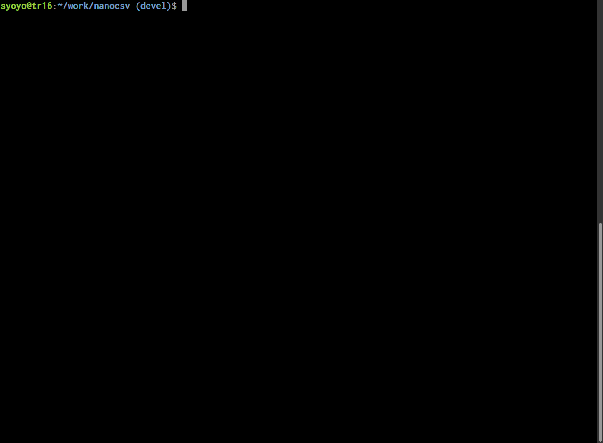
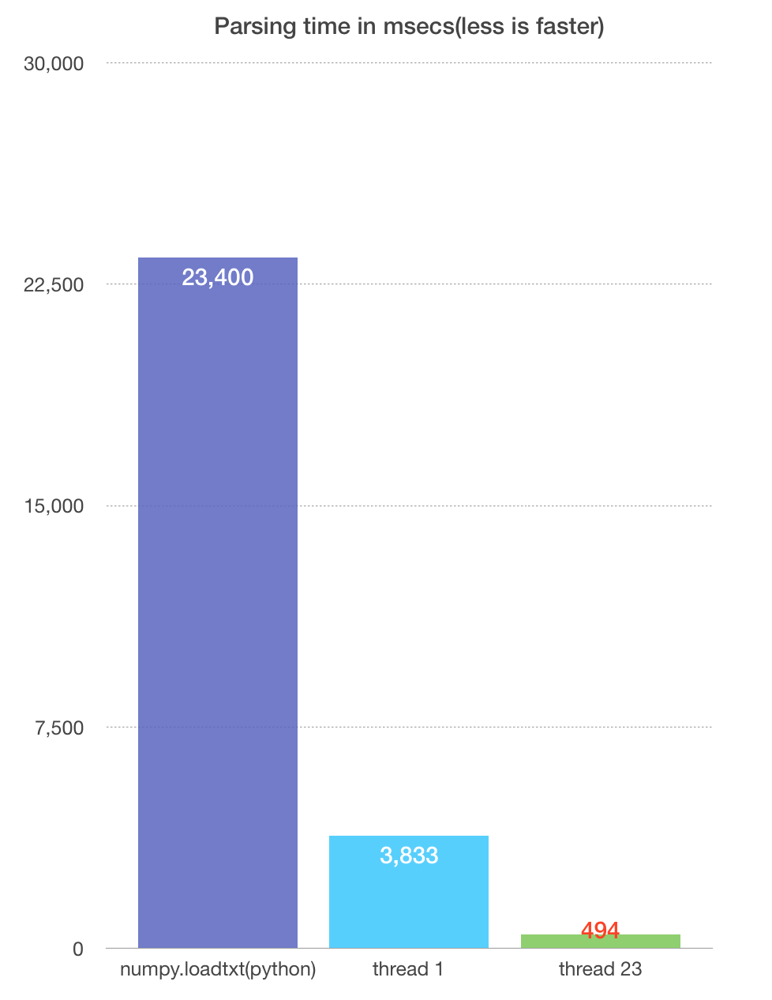

# NanoCSV, Faster C++11 multithreaded header-only CSV parser

NanoCSV is a fater C++11 multithreaded header-only CSV parser with only STL dependency.
NanoCSV is designed for CSV data with numeric values.




## Status

In development.
Currently CSV without no header(e.g. Tensor data saved by `numpy.savetxt`) are supported.
Not recommended to use NanoCSV in production at the moment.

## Requirements

* C++11 compiler(with `thread` support)

## Usage

```c++

// defined this only in **one** c++ file.
#define NANOCSV_IMPLEMENTATION
#include "nanocsv.h"

int main(int argc, char **argv)
{
  if (argc < 2) {
    std::cout << "csv_parser_example input.csv (num_threads) (delimiter)\n";
  }

  std::string filename("./data/array-4-5.csv");
  int num_threads = -1; // -1 = use all system threads
  char delimiter = ' '; // delimiter character.

  if (argc > 1) {
    filename = argv[1];
  }

  if (argc > 2) {
    num_threads = std::atoi(argv[2]);
  }

  if (argc > 3) {
    delimiter = argv[3][0];
  }

  nanocsv::ParseOption option;
  option.delimiter = delimiter;
  option.req_num_threads = num_threads;
  option.verbose = true; // verbse message will be stored in `warn`.

  std::string warn;
  std::string err;

  nanocsv::CSV<float> csv;

  bool ret = nanocsv::ParseCSVFromFile(filename, option, &csv, &warn, &err);

  if (!warn.empty()) {
    std::cout << "WARN: " << warn << "\n";
  }


  if (!ret) {

    if (!err.empty()) {
      std::cout << "ERROR: " << err << "\n";
    }

    return EXIT_FAILURE;
  }

  std::cout << "num records(rows) = " << csv.num_records << "\n";
  std::cout << "num fields(columns) = " << csv.num_fields << "\n";

  // values are 1D array of length [num_records * num_fields]
  // std::cout << csv.values[4 * num_fields + 3] << "\n";


  return EXIT_SUCCESS;
}
```

## Compiler options

* NANOCSV_NO_IO : Disable I/O(file access, stdio, mmap).


## TODO

* [ ] mmap based API
* [ ] Reduce memory usage. Currently nanocsv allocates some memory for intermediate buffer.
* [ ] Robust error handling.
* [ ] Support header.
* [ ] Support different number of fields among records;
* [ ] Parse complex value(e.g. `3.0 + 4.2j`)
* [ ] Parse some special values, for example `#INF`, `#NAN`.
* [ ] CSV writer.
* [ ] Write tests.
* [ ] Remove libm(`pow`) dependency.

## Performance

Dataset is 8192 x 4096, 800 MB in file size(generated by `tools/gencsv/gen.py`)

* Thradripper 1950X
* DDR4 2666 64 GB memory



### 1 thread.

```
total parsing time: 3833.33 ms
  line detection : 1264.99 ms
  alloc buf      : 0.016351 ms
  parse          : 2508.83 ms
  construct      : 55.726 ms
```

### 16 thread.

```
total parsing time: 545.646 ms
  line detection : 159.078 ms
  alloc buf      : 0.077979 ms
  parse          : 337.207 ms
  construct      : 46.7815 ms
```


### 23 threads

Since 23 threads are faster than 32 thread for 1950x.

```
total parsing time: 494.849 ms
  line detection : 127.176 ms
  alloc buf      : 0.050988 ms
  parse          : 314.287 ms
  construct      : 50.7568 ms
```

Roughly **7.7 times faster** than signle therad parsing.

### Note on memory consumption

Not sure, but it should not exceed 3 * filesize, so guess 2.4 GB.

### In python

Using `numpy.loadtxt` to load data takes 23.4 secs.

23 threaded naocsv parsing is Roughly **40 times faster** than `numpy.loadtxt`.

## References

* RFC 4180 https://www.ietf.org/rfc/rfc4180.txt

## License

MIT License

### Third-party license

* stack_container : Copyright (c) 2006-2008 The Chromium Authors. BSD-style license.

